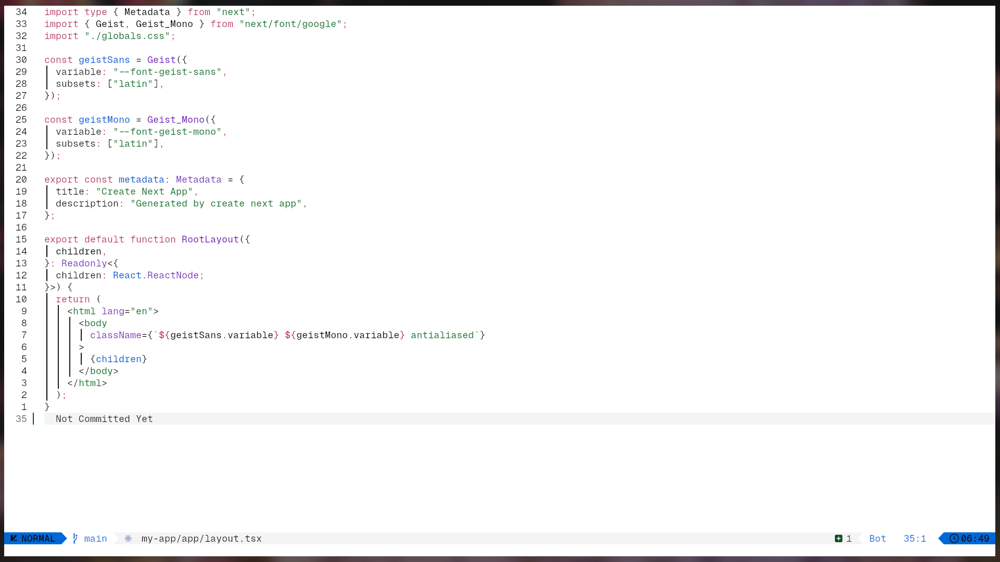
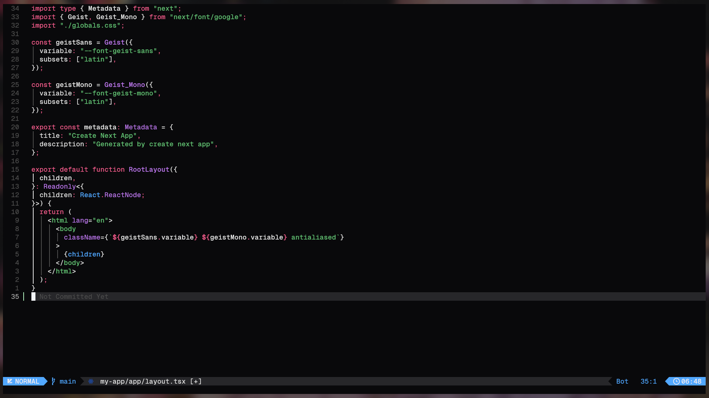

# Vercel Theme

<a href="https://dotfyle.com/plugins/tiesen243/vercel.nvim">
  
</a>

## Preview

### Light Theme



### Dark Theme



## Installation

1. Using `Lazy`:

```lua
{ 'tiesen243/vercel.nvim' },
```

2. Using `Packer`:

```lua
use 'tiesen243/vercel.nvim'
```

## Configuration

To configure the plugin, you can call require('vercel').setup({}), passing the table with the values in it. The following are the **defaults**:

```lua
{
    "tiesen243/vercel.nvim",
    lazy = false,
    priority = 1000,
    config = function()
        require("vercel").setup({
            theme = "light"        -- String: Sets the theme to light or dark (Default: light)
            transparent = false,   -- Boolean: Sets the background to transparent (Default: false)
            italics = {
                comments = true,   -- Boolean: Italicizes comments (Default: true)
                keywords = true,   -- Boolean: Italicizes keywords (Default: true)
                functions = true,  -- Boolean: Italicizes functions (Default: true)
                strings = true,    -- Boolean: Italicizes strings (Default: true)
                variables = true,  -- Boolean: Italicizes variables (Default: true)
                bufferline = false -- Boolean: Italicizes bufferline (Default: false)
            },
            overrides = {},        -- A dictionary of group names, can be a function returning a dictionary or a table.
        })

        -- This must be called before setting the colorscheme, otherwise it will always default to light mode
        vim.cmd.colorscheme("vercel")
    end,
}
```

### Specifics for Some Plugins

#### Bufferline.nvim

To use the theme with [bufferline.nvim](https://github.com/akinsho/bufferline.nvim), you can use the following configuration:

```lua
require('bufferline').setup({
  highlights = function()
    local status_ok, vercel = pcall(require, "vercel")
    if not status_ok then
      return {}
    end
    return vercel.highlights.bufferline
  end,
})
```

#### Neo-tree.nvim

For better experience with this theme, I recommend changing the folder icons to:

```lua
require('neo-tree').setup({
  default_component_configs = {
    icon = {
      folder_closed = "",
      folder_open = "",
      folder_empty = "",
    },
  }
}
```

## Contributing

Contributions are welcome, please open an issue if you encounter any bug or if you find any improvements are needed for the code, also feel free to open a PR.

## Special Thanks

- This project is based on [nvim-colorscheme-template](https://github.com/datsfilipe/nvim-colorscheme-template) by @datsfilipe, used under the MIT License.

## License

This project is licensed under the MIT License - see the [LICENSE](./LICENSE) file for details.
